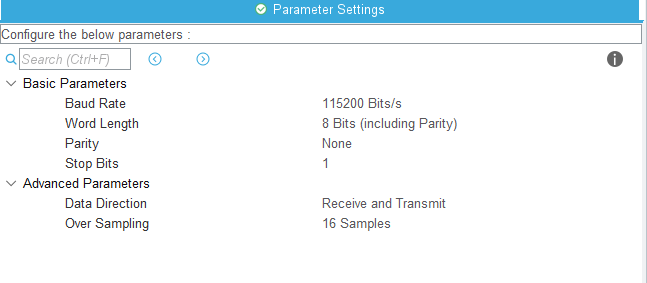
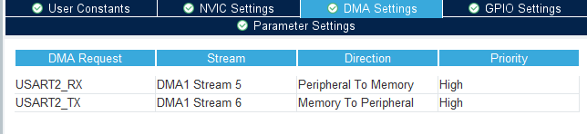
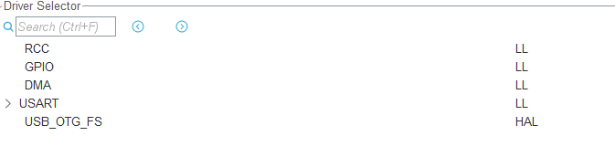
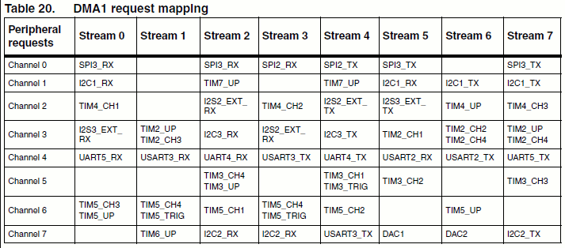

# STM32_UART_DMA_LL

>TR

Bu kod deposu UART haberleşme protokolü (DMA üzerinden) LL kütüphanesi ile nasıl haberleşme yapılacağını içermektedir. Rx ve Tx haberleşmenin örnekleri aynı proje içerisinde verilmiştir. 

## Uart_DMA_LL

Kullanım kolaylığı açısından bu kod deposunda LL için bir kütüphane oluşturulmuştur. Kütüphanenin [header](https://github.com/citax/STM32_UART_DMA_LL/blob/main/STM_Project/Core/Inc/LL_UART_DMA.h) ve [source](https://github.com/citax/STM32_UART_DMA_LL/blob/main/STM_Project/Core/Src/LL_UART_DMA.c) dosyalarına bu bağlantılardan ulaşılabilir. Rx fonksiyonları aşağıda verildiği gibidir:

1. `void LL_UART_DMA_RX_Config(USART_TypeDef *USARTx ,DMA_TypeDef *DMAx, uint32_t Periphs, uint32_t Stream, IRQn_Type IRQn, uint8_t DstAddress[], uint8_t Rx_Buffer_Size);`

		Bu fonksiyon Uart Rx konfigürasyonları için kullanılmaktadır. Girdi olarak aldığı argümanlar:

		1. USARTx
		2. DMAx
		3. Periphs
		4. Stream
		5. IRQn
		6. DstAddress[]
		7. Rx_Buffer_Size

2. ` void LL_UART_DMA_RX_Start(USART_TypeDef *USARTx, DMA_TypeDef *DMAx, uint32_t Stream); ` 

		Bu fonksiyon Uart Rx'nin başlatılması için kullanılmaktadır. Girdi olarak aldığı argümanlar:

		1. USARTx
		2. DMAx
		3. Stream

3. `void LL_UART_DMA_RX_Stop(USART_TypeDef *USARTx, DMA_TypeDef *DMAx, uint32_t Stream);`

		Bu fonksiyon Uart Rx'nin durdurulması için kullanılmaktadır. Girdi olarak aldığı argümanlar:

		1. USARTx
		2. DMAx
		3. Stream

4. `void LL_UART_DMA_RX_Interrupt(void);`

		Bu fonksiyon Uart Rx kesmesi içindir. Uart Rx hangi streamde ise o streamin kesme fonksiyonunun içerisinde kullanılmalıdır.

-----------------

* Örnek kod STM32 [NUCLEO-F446ZE](https://www.st.com/en/evaluation-tools/nucleo-f446ze.html)  kartı üzerinde yazılmıştır.

* LL kütüphanesi ile yazılmış STM32'nin kendi örnek kodları baz alınmıştır.
    * STM32CubeIDE'de proje oluştururken işlemci seçimi kısmında `Example Projects` başlığı altında doğru filtrelemeler yapılarak istenen konu hakkında bir çok örnek çalışmaya ulaşılabilir. Ancak dikkat edilmelidir ki bazı örnekler eski sürümlerde kalmış ve çalışmamaktadırlar.

* LL ve HAL kütüphanesinin kullanıcı dökümanı ([User Manual](https://www.st.com/resource/en/user_manual/um1725-description-of-stm32f4-hal-and-lowlayer-drivers-stmicroelectronics.pdf)) baz alınmıştır.

* Örnekte USART2 hattı kullanılmıştır.

* Normalde NUCLEO ve DISCOVERY geliştirme kartları özelinde herhangi bir USB-TTL kullanmadan USB kablosu üzerinden USART2 hattı ile haberleşme yapılabilmektedir. Ancak bu özellikler kartın üzerindeki jumperlar ile ayarlanmaktadır. Bu örnekte USB-TTL aracılığı ile haberleşme yapılmıştır ve haberleşmenin bu sayede daha sağlıklı olduğu görülmüştür. Hata yaşandığında donanımdan kaynaklı hataların önüne geçmek için USB-TTL kullanımı tavsiye edilir. 

| USB-TLL       | <====>        | NUCLEO|
| ------------- |:-------------:| -----:|
| GND| <====> | GND |
| RX     | <====>      |   TX (PA2)  |
| TX | <====>     |    RX (PA3)|

* Tera Term, Hercules, PuTTY, RealTerm gibi bir çok terminal emülatörü kullanılabilir. USB-TTL portu, UART haberleşme hızı (Baud Rate) ayarları doğru yapılmalıdır. Örnekte haberleşme hızı `115200` olarak kullanılmaktadır. 

### Veri Alma (Recieve - RX) Konfigürasyonları ve Kodları 

STM32CubeIDE programında kullanılacak işlemci ya da kart seçilerek proje oluşturulmalıdır. Daha sonra UART ve DMA konfigürasyonları için aşağıdaki adımlar izlenmelidir. 

1. `Pinout & Configuration` başlığı altında bulunan `Connectivity` sekmesinde bulunan `USART2` hattı `Asynchronous` olarak ayarlanır.

2. USART2 konfigürasyonları aşağıdaki resimde belirtildiği gibi yapılmıştır. Projenize göre değiştirilebilir.

  

3. `DMA Settings` sekmesinden `ADD` ile Rx ve TX için DMA açılması gerekmektedir. Burada DMA'nın yönü, önceliği ve yayın kanallarının ayarları yapılmaktadır. 

  

4. `.ioc` dosyasında varsayılan kütüphane HAL kütüphanesidir ve kod derlenince HAL dosyalarını projeye eklecektir. LL'nin HAL yerine kullanılması için `Project Manager`, `Advanced Settings` sekmesinden HAL seçenekleri LL ile değiştirilmelidir. 

  

5. Kod derlenir ve artık `.ioc` dosyası ile herhangi bir işlem yapılmayacaktır.

6. `main.c` dosyasında `MX_USART2_UART_Init()` fonksiyonu UART ve UART için DMA konfigürasyonlarının yapıldığı fonksiyondur. Bu fonksiyon CubeIDE tarafından kod derlemesi yapıldığı zaman kendiliğinden oluşturulur ve `.ioc` dosyasında yapılmış ayarlara göre kodlar oluşturulur. 

>Bu aşamalarda yazılacak configürasyon kodları hali hazırda CubeIDE tarfından yapılmış olabilir. İsteğe bağlı olarak kodlar kısaltılabilir ama önerilmez. Bu örnekte kritik ayarlamaların yazılımcı tarafından tekrar yapılması önerilir.
--------------------

**_Aşağıdaki kodlar sırası ile verilmiş ve anlatılmıştır._**

> Her LL fonksiyonu ayrıntılı şekilde kütüphane içerisinden ve HAL-LL kullanıcı dökümanından ayrıntılı şekilde incelenmesi tavsiye edilir.

* `/* USER CODE BEGIN USART2_Init 1 */` yorum satırları arasına konfigürasyon kodları yazılacaktır. Bu yorum satırları arasına yazılmadığı taktirde `.ioc` dosyasından yapılan herhangi bir değişiklik ve kod derlemesinde yazılan kodlar silinecektir. 

* `LL_AHB1_GRP1_EnableClock();` komutu ile DMA1 için Clock aktif edilmelidir. Örnekte yapılan konfigürasyon şu şekildedir:

        LL_AHB1_GRP1_EnableClock(LL_AHB1_GRP1_PERIPH_DMA1);

* `NVIC_SetPriority();` ile NVIC önceliği belirlenmelidir. Örnekte yapılan konfigürasyon şu şekildedir:
        
        NVIC_SetPriority(DMA1_Stream5_IRQn, 0);

* `NVIC_EnableIRQ(DMA1_Stream5_IRQn);` ile NVIC aktif edilmelidir.

>Konfigürasyon yapılırken kullanılan `DMA1_Stream5` belirlenirken `DMA1 Request Mapping` kullanılmalıdır. STM32F4xx serisi için `DMA1 Request Mapping` tablosu aşağıda verilmiştir. Belirtilen Channel ve Stream'ler kesişimindeki USART içindir.    

  

* `LL_DMA_ConfigTransfer()` bu fonksiyon ile DMA Transfer konfigürasyonları yapılır. Fonksiyon isterleri `void LL_DMA_ConfigTransfer(DMA_TypeDef *DMAx, uint32_t Stream, uint32_t Configuration)` şeklindedir. Ancak `|` işareti ile daha fazla konfigürasyon yapmamıza olanak tanır. Bu konfigürasyonlar hali hazırda CubeIDE tarafından yapılmış olabilir. Örnekte yapılan konfigürasyon şu şekildedir: 

        LL_DMA_ConfigTransfer(DMA1, LL_DMA_STREAM_5,
			      LL_DMA_DIRECTION_PERIPH_TO_MEMORY		|
  			      LL_DMA_PRIORITY_HIGH		  	|
		              LL_DMA_MODE_CIRCULAR			|
		              LL_DMA_PERIPH_NOINCREMENT			|
  			      LL_DMA_MEMORY_INCREMENT			|
  			      LL_DMA_PDATAALIGN_BYTE			|
  			      LL_DMA_MDATAALIGN_BYTE			);`

* `LL_DMA_ConfigAddresses()` kaynak ve hedef adresi belirler. Örnekte yapılan konfigürasyon şu şekildedir:

        LL_DMA_ConfigAddresses(DMA1,
  			       LL_DMA_STREAM_5,
			       LL_USART_DMA_GetRegAddr(USART2) ,
  		  	       (uint32_t)rx_buffer,
			       LL_DMA_DIRECTION_PERIPH_TO_MEMORY);

* `LL_DMA_SetDataLength()` transfer edilen datanın büyüklüğü belirlenmelidir. Örnekte yapılan konfigürasyon şu şekildedir: 
    
        `LL_DMA_SetDataLength(DMA1, LL_DMA_STREAM_5, sizeof(rx_buffer));`

* ` LL_DMA_EnableIT_TC(DMA1, LL_DMA_STREAM_5);` fonksiyonu ile transfer tamamlandı kesmesi (Interrupt) aktif edilir.

* `LL_DMA_EnableIT_TE(DMA1, LL_DMA_STREAM_5);` fonksiyonu ile transfer hatası kesmesi (Interrupt) aktif edilir.

* `LL_USART_EnableDMAReq_RX(USART2);` ile RX DMA isteği verilir.

* `LL_DMA_EnableStream(DMA1, LL_DMA_STREAM_5);` ile DMA yayını aktif edilir.

> `LL_USART_EnableDMAReq_RX()` ve `LL_DMA_EnableStream()` fonksiyonları (Start_DMA gibi) yazılımcı tarafından oluşturulacak tek bir fonksiyon içerisinde kullanılabilir. Yalnızca bu fonksiyon çağırılarak başka bir noktada kapatılan DMA tekrar açılabilir.

* Rx transferi gerçekleştiğinde gelen veri bir bufferın içine kaydedilecektir. Örnekte `uint8_t   rx_buffer[20];` kodu ile bir buffer tanımlanmıştır. 

--------

`stm32f4xx_it.c` dosyasında her transfer gerçekleştiğinde çağırılacak bir kesme fonksiyonu bulunmaktadır. Rx için bu fonksiyon `DMA1_Stream5_IRQHandler` Tx için ise `DMA1_Stream6_IRQHandler` dır. Ayrıca her transfer gerçekleştiğinde Rx ve Tx için Flag aktif hale gelir. Bu flagler veri okunduktan sonra yeni bir verinin iletimi için sıfırlanmalıdır. Bu sıfırlama işlemi kesme fonksiyonlarının içerisinde yapılır. Örnekteki kod şu şekildedir:

        void DMA1_Stream5_IRQHandler(void)
        {
         /* USER CODE BEGIN DMA1_Stream5_IRQn 0 */
	        if(LL_DMA_IsActiveFlag_TC5(DMA1)){

			LL_DMA_ClearFlag_TC5(DMA1);

			rx_cmplt = 1;
	    }

	    else if(LL_DMA_IsActiveFlag_TE5(DMA1)){

			LL_DMA_ClearFlag_TE5(DMA1);
			rx_error = 1;
	    }

	    else {

	    }

> ENG

This repository contains stm32 uart communication with dma and written with LL library
